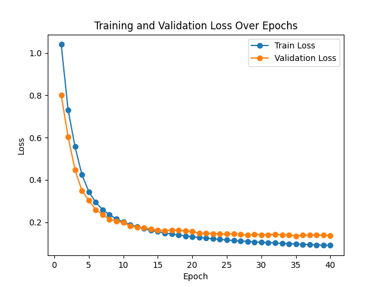

# HOCR: Handwriting OCR project

## Architecture

### DenseNet + Transformer decoder

The model uses a stacked DenseNet, with residual connections and positional embedding to store spatial informations, and a Transformer decoder to predict the $\LaTeX$ formula.

The model comprises two main components:

- **Encoder**: A stacked DenseNet architecture that processes input images to extract meaningful features.
- **Decoder**: A Transformer-based decoder that translates the extracted features into LaTeX code.

#### Detailed Architecture
1. DenseNet Encoder

- DenseNetBone: The fundamental building block, consisting of two convolutional layers with bottleneck layers and optional dropout for regularization.
- DenseNet: Stacks multiple DenseNetBone blocks and includes transition layers to reduce spatial dimensions and channel numbers.
- StackedDenseNetEncoder: Combines multiple DenseNet modules with residual connections, culminating in a final convolution and 2D positional encoding to prepare features for the decoder.

2. Transformer Decoder

- Embedding Layer: Converts token IDs into dense vectors.
- Positional Encoding: Adds sinusoidal positional information to embeddings.
- TransformerDecoderLayer: Comprises multi-head attention and feed-forward neural networks.
- Final Linear Layer: Maps decoder outputs to vocabulary size for token prediction.

### Workflow

- Image Preprocessing: Converts input images to grayscale, applies binary thresholding to ensure white formulas on black backgrounds, resizes to 224x224, and normalizes.
- Feature Extraction: The DenseNet encoder processes the preprocessed image to extract feature maps.
- Sequence Generation: The Transformer decoder generates LaTeX tokens based on the encoder's output, utilizing beam search to optimize predictions.


##### Previous Failed Architecture: ~~ViT~~ + Transformer

*Reason why ViT doesn't work well*: 

Domain differences in pre-training ViT models: ViT (Vision Transformer) is usually pre-trained on large-scale natural image datasets like ImageNet. Your dataset, on the other hand, is an image of handwritten mathematical formulas, which is very different from natural images in terms of feature distribution. A pre-trained ViT model may not be able to extract valid features, resulting in encoder output that is meaningless to the decoder.

Lack of low-level feature extraction: handwritten formula images have complex local features, such as stroke and symbol details. viT slices the image directly into patches and then performs a global self-attention mechanism, which may not be able to capture these critical local features.


## Datasets and preprocessing

The dataset combines many different datasets, with a total amount of over 240K images. 

The images are onverted to grayscale, applied binary thresholding to ensure white formulas on black backgrounds, resized to 224x224, and normalized.

### Dataset Structure
The project expects the dataset to be in a Parquet file (.parquet) with the following columns:

- formula: The LaTeX expression of the handwritten formula.
- filename: The name of the image file.
- image: The binary content of the image.

## Installation

### Prerequisites

Python: 3.10 or higher
PyTorch: 2.1.2 or higher
CUDA: cu118 For GPU acceleration


### init

The versions of the packages listed in `requirements.txt` are not guaranteed to work.

`pip install -r requirements.txt`

## Run


### Training

Execute the training script by `python densenet_model.py [OPTIONS]`.

The options are:
| Argument               | Type    | Default Value                                      | Description                                      |
|------------------------|---------|----------------------------------------------------|--------------------------------------------------|
| `--data_pq_file`       | `str`   | `dataset/train_parquets/training_data.parquet`     | Path to the training data parquet file           |
| `--dictionary_dir`     | `str`   | `dataset/dictionary.txt`                           | Path to the dictionary file                      |
| `--saved_tokenizer_dir`| `str`   | `dataset/whole_tokenizer.json`                     | Path to save/load the custom tokenizer           |
| `--hidden_dim`         | `int`   | `512`                                              | Hidden dimension size                            |
| `--num_layers`         | `int`   | `8`                                                | Number of transformer decoder layers             |
| `--num_heads`          | `int`   | `16`                                               | Number of attention heads                        |
| `--batch_size`         | `int`   | `32`                                               | Batch size for training and validation           |
| `--num_epochs`         | `int`   | `40`                                               | Number of training epochs                        |
| `--learning_rate`      | `float` | `1e-4`                                             | Learning rate for optimizer                      |
| `--weight_decay`       | `float` | `1e-4`                                             | Weight decay for optimizer                       |
| `--test_size`          | `float` | `0.1`                                              | Proportion of dataset for validation split       |
| `--random_state`       | `int`   | `5525`                                             | Random state for dataset splitting               |


```bash
python densenet_model.py --data_pq_file path/to/training_data.parquet \
                         --dictionary_dir path/to/dictionary.txt \
                         --saved_tokenizer_dir path/to/custom_tokenizer.json \
                         --hidden_dim 256 \
                         --num_layers 6 \
                         --num_heads 8 \
                         --batch_size 64 \
                         --num_epochs 50 \
                         --learning_rate 5e-5 \
                         --weight_decay 1e-4

```

### Inference

Ensure you have the test datasets, `python densenet_inference.py`.

Options:
| Argument               | Type    | Default Value                                      | Description                                      |
|------------------------|---------|----------------------------------------------------|--------------------------------------------------|
| `--checkpoint`         | `str`   | **Required**                                       | Path to the model checkpoint (.pth file)         |
| `--tokenizer`          | `str`   | **Required**                                       | Path to the custom tokenizer (.json file)        |
| `--test_parquet_path`  | `str`   | **Required**                                       | Path to the test data Parquet file               |
| `--test_dataset_name`  | `str`   | **Required**                                       | The name of the testing dataset                  |
| `--output_file`        | `str`   | **Required**                                       | Path to save the prediction results              |
| `--hidden_dim`         | `int`   | `512`                                              | Hidden dimension size                            |
| `--num_layers`         | `int`   | `8`                                                | Number of transformer decoder layers             |
| `--num_heads`          | `int`   | `16`                                               | Number of attention heads                        |


```bash
python densenet_inference.py --checkpoint path/to/model_checkpoint.pth \
                             --tokenizer path/to/custom_tokenizer.json \
                             --test_parquet_path path/to/test_data.parquet \
                             --test_dataset_name my_test_dataset \
                             --output_file path/to/save_predictions.csv \
                             --hidden_dim 256 \
                             --num_layers 6 \
                             --num_heads 8
```
**Keep dimension same with the checkpoints**


## Results

### Loss

The training loss and validation loss from training 40 epochs, using DenseNet + Transformer:


### BLEU

- The average BLEU score on HME100K is 0.8539.
- The average BLEU score on IM2LATEX is 0.7900.

### ExpRate

- The average ExpRate scores on HME100K is 47.4946%,  (≤1 error): 55.4558%,  (≤2 errors): 62.42%.
- The average ExpRate scores on IM2LATEX is 9.4567%,  (≤1 error): 10.2349%,  (≤2 errors): 13.82%.
